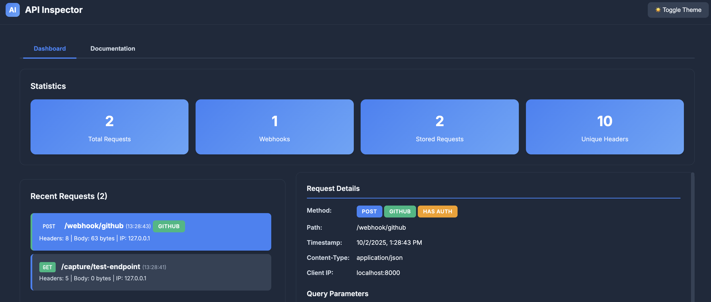

# API Inspector

A utility for capturing, analyzing, and inspecting HTTP requests and webhooks. Useful for debugging API integrations, testing webhook implementations, and analyzing HTTP calls.




## Features

- **Universal Request Capture** - Catch-all endpoints that capture any HTTP method (GET, POST, PUT, DELETE, PATCH, etc.) along with query parameters, headers, and body content
- **Interactive Web Dashboard** - Modern web UI with request list, detailed request viewer, and real-time statistics. Click any captured request to view full details including headers, query parameters, and body
- **Advanced Header Analysis** - Automatic categorization of headers into standard, custom, webhook, security, browser, content, and forwarding types
- **Webhook Detection** - Automatic detection and classification of webhooks from GitHub, Stripe, PayPal, Slack, and generic webhook sources
- **Query Parameter Capture** - Automatically captures and displays URL query parameters in the web UI and logs
- **Security Header Inspection** - Identifies and safely truncates sensitive authorization headers
- **Comprehensive Logging** - All requests logged to file with full details including query parameters, headers, and body content
- **Built-in Documentation** - Documentation tab in the web UI with endpoint reference and usage examples
- **Advanced Search & Filtering** - Search by path, headers, body content, or apply complex filters
- **Export Functionality** - Export captured data to JSON or CSV formats
- **Request Replay** - Replay captured requests to different endpoints for testing
- **Signature Validation** - Validate webhook signatures for GitHub and other services
- **Real-time Statistics** - Track request counts, methods, webhook types, and header usage
- **In-Memory Storage** - Fast access to last 500 requests with automatic rotation

## Quick Start

### Installation

```bash
# Clone the repository
git clone https://github.com/robert-mcdermott/api-inspector.git
cd api-inspector

# Install dependencies using uv
uv sync
```

### Run the Server

```bash
# Start the server
uv run api-inspector.py

# Or use uvicorn directly with auto-reload
uv run uvicorn api-inspector:app --host 0.0.0.0 --port 8000 --reload
```

The server will start on `http://localhost:8000`

### Using the Web Dashboard

Open your browser and navigate to `http://localhost:8000` to access the interactive web dashboard:

- **Dashboard Tab**: View statistics, browse recent requests (last 50), and click any request to see full details including headers, query parameters, and body content
- **Documentation Tab**: View endpoint reference and usage examples

### Make Your First Capture

```bash
# Basic GET request with query parameters
curl "http://localhost:8000/capture/test?param=value&name=test" \
  -H "Authorization: Bearer my-token" \
  -H "X-Custom-Header: test"

# POST with JSON body
curl -X POST "http://localhost:8000/capture/api/endpoint" \
  -H "Content-Type: application/json" \
  -d '{"key": "value", "test": true}'

# Simulate a GitHub webhook
curl -X POST "http://localhost:8000/webhook/github" \
  -H "X-GitHub-Event: push" \
  -H "X-GitHub-Delivery: 12345-67890" \
  -H "X-Hub-Signature-256: sha256=abc123..." \
  -H "Content-Type: application/json" \
  -d '{"ref": "refs/heads/main", "repository": {"name": "test-repo"}}'
```

After making these requests, view them in the web dashboard at `http://localhost:8000`

## Available Endpoints

### Capture Endpoints

| Endpoint | Methods | Description |
|----------|---------|-------------|
| `/capture/{path:path}` | ALL | Main capture endpoint - accepts any HTTP method and path |
| `/webhook` or `/webhook/{path:path}` | ALL | Dedicated webhook capture with enhanced detection |

### Dashboard & Monitoring

| Endpoint | Method | Description |
|----------|--------|-------------|
| `/` | GET | Interactive web dashboard with statistics and recent requests |
| `/health` | GET | Health check with system information and metrics |
| `/admin/monitor` | GET | Real-time monitoring endpoint with live stats |

### Admin Endpoints

| Endpoint | Method | Description |
|----------|--------|-------------|
| `/admin/captured` | GET | View all captured requests with filtering options |
| `/admin/stats` | GET | Comprehensive statistics and analytics |
| `/admin/headers/{request_id}` | GET | Detailed header analysis for a specific request |
| `/admin/header-stats` | GET | Header usage statistics across all requests |
| `/admin/search?q={term}` | GET | Search through captured requests |
| `/admin/filter` | GET | Advanced filtering with multiple criteria |
| `/admin/export?format={json\|csv}` | GET | Export captured data |
| `/admin/clear` | DELETE | Clear all captured requests |
| `/admin/clear/{request_id}` | DELETE | Delete a specific request |
| `/admin/batch-delete` | POST | Delete multiple requests by ID |

### Advanced Features

| Endpoint | Method | Description |
|----------|--------|-------------|
| `/admin/replay/{request_id}` | POST | Replay a captured request to a different URL |
| `/admin/validate-webhook/{request_id}` | POST | Validate webhook signatures (GitHub, etc.) |
| `/admin/simulate-response/{request_id}` | POST | Simulate custom responses for testing |
| `/admin/config` | GET | View current configuration and capabilities |

### API Documentation

- **Swagger UI**: http://localhost:8000/docs
- **ReDoc**: http://localhost:8000/redoc

## Usage Examples

### Testing API Integrations

Point your application or service to the API Inspector endpoints to capture and analyze all API calls:

```python
# In your application configuration
API_ENDPOINT = "http://localhost:8000/capture/my-service"

# All requests to this endpoint will be captured and logged
response = requests.post(API_ENDPOINT, json={"data": "test"})
```

### Debugging Webhooks

Configure webhook providers to send events to API Inspector:

```
GitHub: http://your-server:8000/webhook/github
Stripe: http://your-server:8000/webhook/stripe
Slack: http://your-server:8000/webhook/slack
```

### Viewing Captured Requests

```bash
# Get all captured requests (default limit: 50)
curl http://localhost:8000/admin/captured

# Filter by HTTP method
curl "http://localhost:8000/admin/captured?method=POST&limit=10"

# Show only webhooks from the last hour
curl "http://localhost:8000/admin/captured?webhook_only=true&since_minutes=60"

# Search for specific content
curl "http://localhost:8000/admin/search?q=github&field=headers"
```

### Exporting Data

```bash
# Export as JSON
curl "http://localhost:8000/admin/export?format=json" > captures.json

# Export as CSV without request bodies
curl "http://localhost:8000/admin/export?format=csv&include_bodies=false" > captures.csv
```

### Replaying Requests

```bash
# Replay a captured request to your actual API
curl -X POST "http://localhost:8000/admin/replay/{request_id}" \
  -H "Content-Type: application/json" \
  -d '{"target_url": "https://api.example.com/endpoint"}'
```

## What Gets Captured

API Inspector captures comprehensive details about each request:

- **HTTP Method**: GET, POST, PUT, DELETE, PATCH, etc.
- **Path & Query Parameters**: Full URL path and all query string parameters
- **Headers**: All request headers, automatically categorized into:
  - Standard HTTP Headers (Content-Type, Accept, User-Agent, etc.)
  - Security Headers (Authorization, X-API-Key, X-Hub-Signature, etc.)
  - Webhook Headers (X-GitHub-Event, X-Stripe-Signature, etc.)
  - Custom Headers (X-* and Custom-* prefixed headers)
  - Browser Headers (Accept-Language, DNT, Sec-Fetch-* headers)
  - Content Headers (Content-Type, Content-Length, Content-Encoding, etc.)
  - Forwarding Headers (X-Forwarded-For, X-Real-IP, CF-Connecting-IP, etc.)
- **Request Body**: Full request body parsed based on content type (JSON, form data, text, binary)
- **Client Information**: IP address, user agent, timestamp
- **Webhook Detection**: Automatically identifies webhook type based on headers and patterns

## Webhook Detection

Automatically detects and identifies webhooks from:

- **GitHub** - Identifies via `X-GitHub-Event` header
- **Stripe** - Identifies via `X-Stripe-Signature` header
- **PayPal** - Identifies via `X-PayPal-*` headers
- **Slack** - Identifies via `X-Slack-Signature` header
- **Generic Webhooks** - Identifies via common webhook patterns

## Configuration

The application uses in-memory storage with the following defaults:

- **Max Stored Requests**: 500 (automatically rotates)
- **Log File**: `api_captures.log`
- **Max Body Log Size**: 2048 bytes (larger bodies are truncated in logs)
- **Host**: 0.0.0.0 (all interfaces)
- **Port**: 8000

## Use Cases

### For Developers
- Test API integrations during development
- Debug webhook implementations
- Inspect request/response patterns
- Validate request payloads and headers

### For QA Engineers
- Verify API contract compliance
- Test edge cases and error scenarios
- Capture requests for test data generation
- Validate webhook signature mechanisms

### For Security Professionals
- Analyze HTTP header usage patterns
- Inspect authentication mechanisms
- Validate security header implementations
- Test for header injection vulnerabilities

### For Integration Testing
- Mock third-party webhook providers
- Capture and replay production-like requests
- Test rate limiting and retry logic
- Validate request transformation logic

## Development

### Project Structure

```
api-inspector/
├── main.py              # Single-file FastAPI application
├── pyproject.toml       # Dependencies and project metadata
├── uv.lock             # Locked dependency versions
├── api_captures.log    # Request log file (created on first run)
├── CLAUDE.md           # Developer guidance for Claude Code
└── README.md           # This file
```

### Key Components

- **Data Models**: `CapturedRequest` and `HeaderAnalysis` Pydantic models
- **Storage**: In-memory lists and dictionaries (easily replaceable with Redis/DB)
- **Analysis Functions**: `analyze_headers()`, `detect_webhook_type()`, `log_request_details()`
- **Endpoints**: Organized into capture, admin, and utility endpoints

## Dependencies

- **FastAPI** - Modern web framework for building APIs
- **Uvicorn** - Lightning-fast ASGI server
- **Pydantic** - Data validation using Python type annotations
- **httpx** - HTTP client for request replay functionality

## Limitations

- **In-Memory Storage**: Data is lost on restart (configure external storage for persistence)
- **Single Instance**: Not designed for horizontal scaling without external storage
- **No Authentication**: Admin endpoints are unprotected (add auth for production use)
- **Limited Capacity**: Stores only the last 500 requests

## Future Enhancements

- Persistent storage backend (Redis, PostgreSQL)
- WebSocket support for real-time updates
- Request/response mocking capabilities
- Custom webhook signature validation
- Rate limiting and throttling
- Multi-tenancy support
- Request diffing and comparison tools

## License

Apache 2.0

